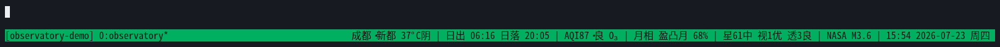

# tmux-status-observatory

一个纯文本 tmux 状态栏，提供天气、未来两小时预报、日出日落、空气质量、月相、观星条件、NASA DONKI 活动和日期时间。

状态栏保留两种动画：

- 预报动画只在“日出日落”左侧移动地点天气和预报；日出日落右侧的内容不会被动画挤动。
- sweep 扫光覆盖当前整条状态栏，只改变前景色，不改变文字和布局。

## 快速安装

依赖：tmux、Bash、Python 3、`curl`、`jq`、`flock`、GNU `date`；tmux 3.6 是当前验证版本。

```bash
git clone https://github.com/LeeKai233/tmux-status-observatory.git
cd tmux-status-observatory
./install.sh
```

安装器会自动更新用户 tmux 配置，不需要手动粘贴 `status-right` 或快捷键配置。它只管理带有 `tmux-status-observatory` 标记的区块，并在修改前创建备份。

然后编辑：

```text
~/.config/tmux/status.env
```

填写 `STATUS_LOCATION_LABEL`、`STATUS_LONGITUDE`、`STATUS_LATITUDE` 和 `QWEATHER_API_KEY`。`NASA_API_KEY` 可以先保留 `DEMO_KEY`，7Timer 观星接口不需要 key。API key 和缓存都不在仓库中。

## 操作

- `C-b a`：运行一次 sweep 扫光。
- `C-b W`：展开或收起未来两小时预报。
- 鼠标点击天气：展开或收起预报。
- `./bin/tmux-status-observatory --detail`：查看数据源和缓存诊断。
- `./install.sh --uninstall`：删除安装器加入的 tmux 配置区块。

## 动画演示

下面的窄幅录屏展示状态栏的常态、预报展开与收缩，以及覆盖整条状态栏的 sweep 扫光动画：



录制脚本使用当前配置和缓存数据，并在临时 tmux socket 中运行，不会连接或修改正在使用的 tmux server。安装 `asciinema`、`agg` 和 `Noto Sans Mono CJK SC` 后，在交互式终端执行：

```bash
make record-demo
```

GIF 默认写入 `assets/tmux-status-observatory.gif`。可通过 `TMUX_STATUS_DEMO_OUTPUT` 指定其他输出路径；脚本不会把 API key 或缓存写入仓库。

## 开发

仓库是唯一源码来源，不需要复制到 `~/.local/bin`。修改后运行：

```bash
make check
```

如果仓库移动，重新运行 `./install.sh` 即可更新 tmux 配置中的入口路径。

数据来源：QWeather、7Timer 和 NASA DONKI。请分别遵守这些服务的使用限制和归属要求。
